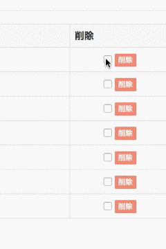

# todo-php
PHPでToDo管理ツールを作りました！

## Installation

1. 適当なディレクトリにclone

  ```bash
  $ git clone git@github.com:nnsnodnb/todo-php.git
  $ cd todo-php
  ```

1. MySQLにログインしデータベース及びテーブルを作成

  ```bash
  mysql> source todo_php.sql;
  ```

1. 設定ファイルの作成

 - サンプルのコピー

  ```bash
  $ cp config.sample.php config.php
  ```
 - 自分のサーバ用に設定

  ```php
  $dsn = 'mysql:host=localhost;dbname=todo_php';
  $user = 'root';
  $password = 'password';

  // 場合によっては以下のリンクも変更
  define('SITE_URL' , 'http://localhost/todo-php') ;
  ```

1. サーバにアップロード

## Specification

 - タスク一覧表示
 - タスク変更・閲覧
 - タスク登録
 - タスク削除

## Bug

- 削除ボタンの横のチェックボックスの挙動がおかしい



JavaScriptでの判定がおかしいようですが，私のスキルではもうどうしようもないです．Forkして修正していただけたら幸いです．

## Author

__[nnsnodnb](https://github.com/nnsnodnb)__
